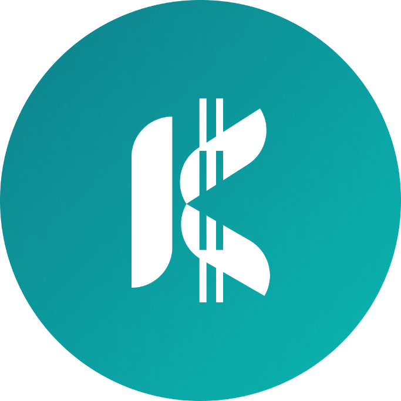

<div align="center">

  

  # 💼 Kelola (Kasir & Keuangan Kampus)

  **Aplikasi Kasir Sederhana, Cepat, dan 100% Offline untuk Mahasiswa Pejuang Usaha di Kampus**

  [](https://developer.android.com)
  [](https://github.com/GHXZY/Kelola/releases/download/Kelola-Android-App/Kelola-release.apk)
  [](https://kotlinlang.org)
  [](https://developer.android.com/jetpack/compose)
  [](https://developer.android.com/training/data-storage/room)
  [](#-sistem-penyimpanan-data-arsitektur-local-first)

  <br /><br />

  <p align="center">
    <a href="https://github.com/GHXZY/Kelola/releases/download/Kelola-Android-App/Kelola-release.apk">
      
    </a>
    &nbsp;&nbsp;
    <a href="https://github.com/GHXZY/Kelola/releases">
      
    </a>
  </p>

  <br />

  <p align="center">
    <a href="#-pembaruan--versi-terbaru">Pembaruan & Versi</a> •
    <a href="#-tentang-kelola">Tentang Kelola</a> •
    <a href="#-fitur-unggulan">Fitur Unggulan</a> •
    <a href="#-tabel-perbandingan">Perbandingan</a> •
    <a href="#-sistem-penyimpanan-data-arsitektur-local-first">Sistem Penyimpanan</a> •
    <a href="#%EF%B8%8F-teknologi--pustaka">Teknologi</a> •
    <a href="#-panduan-instalasi--build">Instalasi & Build</a>
  </p>

</div>

---

## 📖 Tentang Kelola

Banyak mahasiswa memulai usaha di lingkungan kampus—mulai dari berjualan makanan ringan di kelas, minuman dingin saat kepanitiaan, sistem pre-order (PO) makanan, pulsa & paket data, hingga merchandise organisasi. Namun, transaksi di kampus memiliki tantangan nyata:

* 📶 **Sinyal Kampus Sering Drop**: Berada di gedung bertingkat, lorong, atau basement sering membuat aplikasi kasir berbasis cloud gagal memuat atau macet di tengah transaksi.
* 🤝 **Teman Sering "Kasbon"**: Budaya titip beli atau *"bayar nanti pas selesai kelas ya"* sering berakhir lupa dan membuat uang modal jualan nombok.
* 🪙 **Uang Pecahan Kembalian Kurang**: Saat istirahat singkat antar-mata kuliah, antrean cepat sering terhambat uang kembalian pecahan kecil yang belum tersedia di dompet.
* 💸 **Aplikasi POS Lain Mahal & Rumit**: Aplikasi kasir umum mengharuskan langganan bulanan, wajib registrasi email/nomor HP, serta penuh fitur rumit yang tidak dibutuhkan pedagang kecil.

**Kelola** dirancang khusus untuk memecahkan semua masalah tersebut. Mengusung filosofi **Local-First & Zero Latency**, Kelola memberikan pengalaman kasir yang instan, tanpa login, tanpa internet, dan dilengkapi fitur khas mahasiswa seperti *Pelacak Kasbon Teman* dan *Pencatat Kembalian Tertunda*.

---

## 🚀 Pembaruan & Versi Terbaru

### 📦 Versi 1.6.0 (Rilis Terbaru)
[](https://github.com/GHXZY/Kelola/releases/download/Kelola-Android-App/Kelola-release.apk)
*Tanggal Rilis: September 2026 | Berkas: `Kelola-release.apk` (~16.7 MB)*

Versi **1.6.0** menghadirkan pembaruan besar pada sistem kustomisasi visual, manajemen pembayaran kasir, pencetakan dan pembagian struk digital (PDF), hingga peningkatan kenyamanan antarmuka pengguna:

1. **🎨 4 Pilihan Tema Warna Lengkap (Personalisasi Seluruh Aplikasi)**
   - Mendukung 4 palet warna utama: **Biru** (*Oceanic Modernity*), **Pink** (*Blush Blossom*), **Coklat** (*Terra & Flora*), dan **Orange** (*Solar Flare*).
   - Setiap tema otomatis mengadaptasi seluruh halaman (Beranda, Kasir, Keranjang, Laporan, Grafik Arus Kas, Produk, Kasbon, Catatan, Promo, dan Pengaturan) baik dalam **Mode Terang (*Light*)** maupun **Mode Gelap (*Dark*)**.
   - Dilengkapi kartu swatch warna interaktif dengan indikator centang pada menu Pengaturan.

2. **💳 Metode Pembayaran Default E-Wallet & Rekening Bank Toko**
   - Fitur **Akun Rekening Bank Transfer**: Simpan hingga 5 rekening bank toko (Nama Bank, Nomor Rekening, dan Atas Nama) agar kasir dapat memperlihatkan atau menyalin detail rekening saat pelanggan memilih metode Transfer.
   - Header akun rekening bank didesain ringkas dan rapi dalam satu baris horizontal.

3. **📄 Ekspor & Pembagian Struk Transaksi Digital (PDF)**
   - Menghasilkan struk resmi berformat PDF beresolusi tinggi langsung dari aplikasi secara *offline*.
   - Memuat detail identitas toko, rincian barang belanjaan, diskon/promo, metode pembayaran, hingga catatan kaki struk.
   - Tombol **Bagikan Struk** ditempatkan di pojok kanan atas dialog detail transaksi untuk kemudahan akses kirim struk ke WhatsApp pelanggan.

4. **⚡ Optimalisasi Kinerja & Android 16 Readiness**
   - Dukungan penuh kompilasi Kotlin 2.0+ dan Android SDK 36.
   - Penguatan integritas data lokal Room Database dan peningkatan efisiensi render antarmuka Jetpack Compose.

---

## ✨ Fitur Unggulan

### 📋 Matriks Solusi Fitur

| Modul Fitur | Ikon | Kemampuan Utama | Manfaat Nyata untuk Mahasiswa |
| :--- | :---: | :--- | :--- |
| **Kasir Cepat** | 🛒 | Keranjang belanja instan, tombol kuantitas responsif, input diskon, dan catatan pesanan | Transaksi selesai dalam hitungan detik saat jeda pergantian kelas |
| **QRIS Smart Crop** | 📱 | Unggah gambar QRIS statis dengan alat pemotong presisi rasio 1:1 langsung di aplikasi | Pembeli dapat memindai kode QR dengan cepat tanpa perlu zoom |
| **Kasbon & Piutang** | 🤝 | Catat nama teman, rincian barang, nominal hutang, kontak, dan status pelunasan | Modal jualan aman dari lupa; ada rekap sisa piutang di beranda |
| **Kembalian Tertunda** | 🪙 | Simpan nominal kembalian pembeli yang belum diserahkan akibat ketiadaan receh | Transaksi tetap jalan lancar tanpa panik mencari uang tukar |
| **Manajemen Stok** | 📦 | Hitung harga beli (modal) vs jual, kalkulasi margin profit, restock, & catat barang rusak | Mengetahui keuntungan bersih riil dan mencegah stok habis tiba-tiba |
| **Laporan & Arus Kas** | 📊 | Ringkasan laba bersih, produk terlaris (best-seller), dan catatan pengeluaran harian | Membantu evaluasi produk mana yang paling disukai teman kampus |
| **Desain Responsif** | 📐 | Mengadopsi *Oceanic Modernity Design System* dengan adaptasi layar 360dp, 412dp, & 430dp | Tampilan presisi, nyaman di mata, dan konsisten di segala model smartphone |

<br />

### ⚖️ Tabel Perbandingan

| Parameter / Kebutuhan | 💼 **Kelola (Kasir Kampus)** | 📱 Aplikasi POS Konvensional / Cloud |
| :--- | :---: | :---: |
| **Konektivitas Internet** | **100% Offline (0ms Latency)** | Membutuhkan sinyal internet stabil |
| **Biaya Penggunaan** | **Gratis & Open Source Selamanya** | Biaya langganan bulanan / per transaksi |
| **Pendaftaran & Akun** | **Tanpa Registrasi (Langsung Pakai)** | Wajib email, nomor HP, & verifikasi OTP |
| **Privasi Data Usaha** | **100% Lokal** di memori internal HP | Disimpan & diolah di server pihak ketiga |
| **Fitur Kasbon Teman** | **Tersedia khusus dengan pelacak nama** | Jarang ada / prosedur pencatatan rumit |
| **Pengingat Uang Kembalian** | **Tersedia otomatis di beranda** | Tidak tersedia (harus manual dicatat di kertas) |
| **Ukuran Aplikasi & Beban RAM** | **Sangat Ringan & Responsif** | Relatif berat dengan latar belakang sinkronisasi |

---

## 💾 Sistem Penyimpanan Data (Arsitektur Local-First)

Kelola mengadopsi prinsip **100% Local-First**, di mana seluruh data bisnis mahasiswa disimpan, diproses, dan dikelola secara mandiri langsung di dalam memori internal perangkat ponsel tanpa ketergantungan pada server cloud maupun koneksi internet.

### 🔍 Cara Kerja Sistem Penyimpanan Local-First

1. **Penyimpanan Primer di Perangkat (*Device-as-Primary*)**:
   - Berbeda dengan aplikasi POS berbasis cloud yang rentan gagal transaksi saat sinyal hilang, Kelola menjadikan basis data SQLite internal (`kelola_database.db`) di ponsel pengguna sebagai sumber kebenaran tunggal (*Single Source of Truth*).
   - Seluruh data transaksi, keranjang belanja, katalog produk, daftar kasbon teman, pengingat uang kembalian, dan arus kas tercatat secara lokal.

2. **Abstraksi Modern dengan Android Jetpack Room**:
   - Menggunakan **Room Persistence Library** sebagai lapisan abstraksi resmi dari Google di atas SQLite murni.
   - Pengecekan kueri SQL diverifikasi langsung saat waktu kompilasi (*compile-time verification*), mencegah bug dan kerusakan skema saat aplikasi berjalan.
   - Mengelompokkan akses data melalui *Data Access Objects* (DAOs) terisolasi: `TransactionDao`, `ProductDao`, `DebtDao`, dan `CashFlowDao`.

3. **Operasi Data Asinkron & Reaktif (*Zero Latency*)**:
   - Seluruh operasi penulisan dan pembacaan data dieksekusi di *background thread* menggunakan **Kotlin Coroutines** (`Dispatchers.IO`), sehingga antarmuka visual tetap ringan dan mulus (*60/120 FPS*).
   - Perubahan data disalurkan secara reaktif ke antarmuka Jetpack Compose melalui **StateFlow**, menyajikan pembaruan data secara instan tanpa perlu memuat ulang (*pull-to-refresh*).

4. **Isolasi Keamanan Sandbox**:
   - Basis data disimpan di dalam direktori privat aplikasi (`/data/data/com.aistudio.kelola/databases/`).
   - Sistem operasi Android melindungi direktori ini dengan mekanisme *application sandboxing*, memastikan data omset, margin keuntungan, dan catatan kasbon teman terlindungi dari aplikasi lain di HP.

5. **Kedaulatan & Portabilitas Data Mandiri**:
   - Pengguna memiliki kendali penuh atas data mereka tanpa terkunci ke ekosistem tertentu (*zero vendor lock-in*).
   - Menyediakan fitur pencadangan (*backup*) dan pemulihan (*restore*) mandiri berkas basis data lokal untuk memudahkan migrasi saat berganti smartphone.

<br />

### 🧱 Matriks Komponen Penyimpanan

| Lapisan / Komponen | Teknologi yang Digunakan | Lokasi / Berkas | Peran dalam Sistem |
| :--- | :--- | :--- | :--- |
| **Penyimpanan Fisik** | SQLite Database Engine | Memori Internal HP (`kelola_database.db`) | Menyimpan seluruh tabel relasional transaksi, kasbon, katalog, dan arus kas. |
| **Lapisan ORM** | Android Jetpack Room | `KelolaDatabase` & DAOs | Memetakan objek data Kotlin ke tabel SQL dan mengeksekusi kueri terstruktur. |
| **Jalur Reaktif** | Kotlin Coroutines & Flow | `Dispatchers.IO` & `StateFlow` | Menjamin operasi baca/tulis berjalan di latar belakang tanpa membekukan antarmuka (*zero lag*). |
| **Keamanan Data** | Android App Sandbox | Direktori Privat Aplikasi | Mengisolasi database agar tidak dapat diakses atau diintip oleh aplikasi pihak ketiga. |
| **Cadangan Data** | File I/O Engine | Format `.db` / `.json` | Memberikan kebebasan ekspor dan impor data secara mandiri tanpa biaya server. |

<br />

### 🌟 4 Keunggulan Nyata bagi Mahasiswa Pejuang Usaha

| Keunggulan | Manfaat Nyata di Lapangan |
| :--- | :--- |
| ⚡ **0ms Latensi (Instan)** | Transaksi kasir selesai seketika tanpa perlu menunggu respon server atau jaringan lemot. |
| 📶 **100% Bebas Kuota & Sinyal** | Berjualan di ruang kelas bertingkat, lorong kampus, basement, kantin, maupun bazar bazar outdoor tetap lancar tanpa internet. |
| 🔒 **Privasi & Keamanan Mutlak** | Data omset, margin laba, dan catatan hutang teman tidak pernah diunggah ke server pihak mana pun. |
| 💰 **Bebas Biaya Selamanya** | Tidak ada biaya sewa hosting database, langganan API bulanan, ataupun potongan biaya per transaksi. |

---

## 🛠️ Teknologi & Pustaka

| Kategori | Teknologi / Pustaka | Versi / Tipe | Peran & Implementasi |
| :--- | :--- | :--- | :--- |
| **Bahasa Pemrograman** | [Kotlin](https://kotlinlang.org/) | `2.0+` | Bahasa modern utama dengan Kotlin Coroutines & StateFlow |
| **UI Framework** | [Jetpack Compose](https://developer.android.com/jetpack/compose) | Material 3 | Desain deklaratif modern dengan Single Activity Architecture |
| **Penyimpanan Lokal** | [Android Jetpack Room](https://developer.android.com/training/data-storage/room) | SQLite ORM | Abstraksi database lokal, automasi migrasi, dan query reaktif |
| **Pengolahan Gambar** | [Coil Compose](https://coil-kt.github.io/coil/) | Async Image Loader | Pemuatan cepat foto katalog produk & gambar kode QRIS |
| **Pola Arsitektur** | MVVM (Model-View-ViewModel) | Reactive Streams | Pemisahan Presentation, Domain, dan Data Layer yang terstruktur |
| **Build Tooling** | Gradle | `9.3.1` (Kotlin DSL) | Konfigurasi modular, automasi build, dan kompresi bundle |

<br />

### 📱 Spesifikasi Perangkat

| Parameter | Spesifikasi Minimum | Rekomendasi |
| :--- | :--- | :--- |
| **Sistem Operasi** | Android 7.0 (Nougat / API 24) | Android 11.0 (API 30) atau lebih baru |
| **Ukuran Layar** | 320dp (Compact Phone) | 360dp – 430dp (FHD+ Standard Phone) |
| **Koneksi Internet** | Tidak Diperlukan (100% Offline) | Opsional (hanya saat mengunduh berkas APK) |
| **Penyimpanan Bebas** | ~35 MB | 100 MB (untuk menampung riwayat & foto produk) |

---

## 📥 Panduan Instalasi & Build

### 🚀 Cara Instalasi Cepat (Pengguna Langsung)

Anda dapat langsung memasang aplikasi di ponsel Android Anda menggunakan berkas release yang telah disediakan:

1. Unduh berkas **[`Kelola-release.apk`](https://github.com/GHXZY/Kelola/releases/download/Kelola-Android-App/Kelola-release.apk)** via GitHub Releases.
2. Kirim berkas APK ke ponsel Android Anda (via WhatsApp, Telegram, Google Drive, atau kabel data USB).
3. Buka File Manager di ponsel dan ketuk berkas `Kelola-release.apk`.
4. Jika muncul peringatan keamanan, aktifkan opsi **"Izinkan penginstalan dari sumber ini"**.
5. Tekan tombol **Install** dan Kelola siap menemani usaha Anda!

> [!NOTE]
> **Kebutuhan Sistem Minimum**: Android 7.0 (API 24) ke atas. Tidak memerlukan akses root ataupun izin internet.

---

### 💻 Panduan Build dari Source Code (Developer)

Bagi pengembang yang ingin memodifikasi atau berkontribusi pada kode sumber:

#### 1. Prasyarat Lingkungan
* **Android Studio**: Ladybug / Meerkat / versi terbaru
* **JDK**: Versi 17 atau 21 (JBR bawaan Android Studio direkomendasikan)
* **Android SDK**: Platform 36 (Android 16 / VanillaIceCream)

#### 2. Langkah Kompilasi
```bash
# 1. Clone repositori ini
git clone https://github.com/GHXZY/Kelola.git
cd Kelola

# 2. Kompilasi & jalankan aplikasi dalam mode debug
./gradlew assembleDebug

# 3. Membuat paket berkas APK Release
./gradlew assembleRelease
```

> [!TIP]
> Berkas APK release yang dihasilkan akan tersimpan di direktori:
> `app/build/outputs/apk/release/app-release.apk`

---

## 🤝 Berkontribusi

Kontribusi dari sesama mahasiswa dan komunitas pengembang *open-source* sangat terbuka lebar:

1. **Fork** repositori ini
2. Buat branch fitur baru (`git checkout -b fitur/fitur-keren`)
3. Commit perubahan Anda (`git commit -m 'feat: Menambahkan fitur kasir kilat'`)
4. Push ke branch Anda (`git push origin fitur/fitur-keren`)
5. Buat **Pull Request** dan jelaskan kontribusi yang Anda buat

---

<div align="center">

  Dibuat dengan ❤️ untuk mendukung semangat kemandirian wirausaha mahasiswa Indonesia.

  ⭐ **Suka dengan aplikasi ini? Jangan lupa berikan bintang di GitHub!** ⭐

</div>
