<div align="center">

  

  # 💼 Kelola (Kasir & Keuangan Kampus)

  **Aplikasi Kasir Sederhana, Cepat, dan 100% Offline untuk Mahasiswa Pejuang Usaha di Kampus**

  [](https://developer.android.com)
  [](https://kotlinlang.org)
  [](https://developer.android.com/jetpack/compose)
  [](https://developer.android.com/training/data-storage/room)
  [](#-sistem-penyimpanan-data-arsitektur-local-first)

  <br />

  <p align="center">
    <a href="#-tentang-kelola">Tentang Kelola</a> •
    <a href="#-fitur-unggulan">Fitur Unggulan</a> •
    <a href="#-tabel-perbandingan">Perbandingan</a> •
    <a href="#-sistem-penyimpanan-data-arsitektur-local-first">Peta Konsep & Arsitektur</a> •
    <a href="#%EF%B8%8F-teknologi--pustaka">Teknologi</a> •
    <a href="#-panduan-instalasi--build">Instalasi & Build</a>
  </p>

</div>

---

## 📖 Tentang Kelola

Banyak mahasiswa memulai usaha di lingkungan kampus—mulai dari berjualan makanan ringan di kelas, minuman dingin saat kepanitiaan, sistem pre-order (PO) makanan, pulsa & paket data, hingga merchandise organisasi. Namun, transaksi di kampus memiliki tantangan nyata:

* 📶 **Sinyal Kampus Sering Drop**: Berada di gedung bertingkat, lorong, atau basement sering membuat aplikasi kasir berbasis cloud gagal memuat atau macet di tengah transaksi.
* 🤝 **Teman Sering "Kasbon"**: Budaya titip beli atau *"bayar nanti pas selesai kelas ya"* sering berakhir lupa dan membuat uang modal jualan nombok.
* 🪙 **Uang Pecahan Kembalian Kurang**: Saat istirahat singkat antar-mata kuliah, antrean cepat sering terhambat uang kembalian pecahan kecil yang belum tersedia di dompet.
* 💸 **Aplikasi POS Lain Mahal & Rumit**: Aplikasi kasir umum mengharuskan langganan bulanan, wajib registrasi email/nomor HP, serta penuh fitur rumit yang tidak dibutuhkan pedagang kecil.

**Kelola** dirancang khusus untuk memecahkan semua masalah tersebut. Mengusung filosofi **Local-First & Zero Latency**, Kelola memberikan pengalaman kasir yang instan, tanpa login, tanpa internet, dan dilengkapi fitur khas mahasiswa seperti *Pelacak Kasbon Teman* dan *Pencatat Kembalian Tertunda*.

---

## ✨ Fitur Unggulan

### 📋 Matriks Solusi Fitur

| Modul Fitur | Ikon | Kemampuan Utama | Manfaat Nyata untuk Mahasiswa |
| :--- | :---: | :--- | :--- |
| **Kasir Cepat** | 🛒 | Keranjang belanja instan, tombol kuantitas responsif, input diskon, dan catatan pesanan | Transaksi selesai dalam hitungan detik saat jeda pergantian kelas |
| **QRIS Smart Crop** | 📱 | Unggah gambar QRIS statis dengan alat pemotong presisi rasio 1:1 langsung di aplikasi | Pembeli dapat memindai kode QR dengan cepat tanpa perlu zoom |
| **Kasbon & Piutang** | 🤝 | Catat nama teman, rincian barang, nominal hutang, kontak, dan status pelunasan | Modal jualan aman dari lupa; ada rekap sisa piutang di beranda |
| **Kembalian Tertunda** | 🪙 | Simpan nominal kembalian pembeli yang belum diserahkan akibat ketiadaan receh | Transaksi tetap jalan lancar tanpa panik mencari uang tukar |
| **Manajemen Stok** | 📦 | Hitung harga beli (modal) vs jual, kalkulasi margin profit, restock, & catat barang rusak | Mengetahui keuntungan bersih riil dan mencegah stok habis tiba-tiba |
| **Laporan & Arus Kas** | 📊 | Ringkasan laba bersih, produk terlaris (best-seller), dan catatan pengeluaran harian | Membantu evaluasi produk mana yang paling disukai teman kampus |
| **Desain Responsif** | 📐 | Mengadopsi *Oceanic Modernity Design System* dengan adaptasi layar 360dp, 412dp, & 430dp | Tampilan presisi, nyaman di mata, dan konsisten di segala model smartphone |

<br />

### ⚖️ Tabel Perbandingan

| Parameter / Kebutuhan | 💼 **Kelola (Kasir Kampus)** | 📱 Aplikasi POS Konvensional / Cloud |
| :--- | :---: | :---: |
| **Konektivitas Internet** | **100% Offline (0ms Latency)** | Membutuhkan sinyal internet stabil |
| **Biaya Penggunaan** | **Gratis & Open Source Selamanya** | Biaya langganan bulanan / per transaksi |
| **Pendaftaran & Akun** | **Tanpa Registrasi (Langsung Pakai)** | Wajib email, nomor HP, & verifikasi OTP |
| **Privasi Data Usaha** | **100% Lokal** di memori internal HP | Disimpan & diolah di server pihak ketiga |
| **Fitur Kasbon Teman** | **Tersedia khusus dengan pelacak nama** | Jarang ada / prosedur pencatatan rumit |
| **Pengingat Uang Kembalian** | **Tersedia otomatis di beranda** | Tidak tersedia (harus manual dicatat di kertas) |
| **Ukuran Aplikasi & Beban RAM** | **Sangat Ringan & Responsif** | Relatif berat dengan latar belakang sinkronisasi |

---

## 💾 Sistem Penyimpanan Data (Arsitektur Local-First)

Kelola mengadopsi prinsip **100% Local-First**, di mana seluruh kendali dan kedaulatan data berada sepenuhnya di tangan pengguna:

```mermaid
flowchart TB
    %% Nodes Mahasiswa / User Layer
    subgraph UserLayer ["👤 PENGGUNA (MAHASISWA WIRAUSAHA)"]
        direction LR
        U1["🛒 Transaksi Kasir"]
        U2["🤝 Catat Kasbon Teman"]
        U3["🪙 Titip Kembalian"]
        U4["📦 Atur Stok & QRIS"]
    end

    %% Presentation Layer
    subgraph PresentationLayer ["🖥️ PRESENTATION LAYER (Jetpack Compose & Material 3)"]
        direction TB
        UI_Nav["🧭 AppNavigation & Scaffold Router"]
        subgraph Screens ["Layar Aplikasi (Oceanic Design System)"]
            S1["KasirScreen<br/><small>Keranjang & Diskon</small>"]
            S2["KasbonScreen<br/><small>Pelacak Piutang Teman</small>"]
            S3["KembalianScreen<br/><small>Antrean Uang Kembalian</small>"]
            S4["KatalogScreen<br/><small>Stok & Smart Crop QRIS</small>"]
            S5["LaporanScreen<br/><small>Laba Rugi & Arus Kas</small>"]
        end
        UI_Nav --> Screens
    end

    %% State & Business Logic Layer
    subgraph LogicLayer ["⚙️ STATE & BUSINESS LOGIC (MVVM)"]
        VM["🎮 MainViewModel<br/><b>StateFlow (UI State)</b>"]
        UC["🧩 Business Logic / Use Cases<br/><i>Kalkulasi Laba • Validasi Stok • Manajemen Diskon</i>"]
        VM --- UC
    end

    %% Persistence Layer
    subgraph DataLayer ["🗄️ PERSISTENCE LAYER (Android Jetpack Room)"]
        direction TB
        DAOs["Data Access Objects (DAOs)<br/><i>TransactionDao • ProductDao • DebtDao • CashFlowDao</i>"]
        DB["⚡ Room Database Engine<br/><i>TypeConverters • Reactive Queries • Migrations</i>"]
        DAOs --> DB
    end

    %% Local Storage Layer
    subgraph StorageLayer ["💾 LOCAL STORAGE (100% Local-First & Zero Latency)"]
        direction LR
        SQLITE[("💽 SQLite Engine<br/>kelola_database.db")]
        SANDBOX["📁 Private App Sandbox<br/>/data/data/com.aistudio.kelola/"]
        BACKUP["📤 Local Backup & Restore<br/>Ekspor / Impor JSON & DB"]
    end

    %% Flow Relationships
    UserLayer ==> UI_Nav
    Screens <==>|"StateFlow & Event Triggers"| VM
    UC <==>|"Coroutines Flow (Dispatchers.IO)"| DAOs
    DB ==> SQLITE
    DB ==> SANDBOX
    SQLITE -.->|"Cadangkan Data"| BACKUP

    %% Node Styling
    classDef user fill:#EFF6FF,stroke:#3B82F6,stroke-width:2px,color:#1E3A8A;
    classDef ui fill:#F0FDF4,stroke:#22C55E,stroke-width:2px,color:#14532D;
    classDef logic fill:#FAF5FF,stroke:#A855F7,stroke-width:2px,color:#581C87;
    classDef data fill:#FFF7ED,stroke:#F97316,stroke-width:2px,color:#7C2D12;
    classDef storage fill:#F8FAFC,stroke:#64748B,stroke-width:2px,color:#0F172A;

    class U1,U2,U3,U4 user;
    class UI_Nav,S1,S2,S3,S4,S5 ui;
    class VM,UC logic;
    class DAOs,DB data;
    class SQLITE,SANDBOX,BACKUP storage;
```



### 🌟 Mengapa Pendekatan Ini Terbaik untuk Mahasiswa?

1. **🔒 Zero Data Leakage / 100% Privat**: Data omset, keuntungan, dan daftar pelanggan tidak pernah dikirim ke server luar atau pihak ketiga.
2. **💰 Tanpa Biaya Server & Bebas Selamanya**: Tidak membutuhkan biaya langganan API, hosting, atau kuota internet saat berjualan.
3. **⚡ Kecepatan Instan (0ms Latency)**: Seluruh operasi baca dan tulis terjadi langsung pada penyimpanan internal perangkat tanpa waktu tunggu (*loading spinner*).
4. **💾 Cadangkan & Pulihkan (Backup & Restore)**: Pengguna dapat mengekspor seluruh basis data ke format berkas lokal untuk dipindahkan ke smartphone baru kapan saja.

---

## 🛠️ Teknologi & Pustaka

| Kategori | Teknologi / Pustaka | Versi / Tipe | Peran & Implementasi |
| :--- | :--- | :--- | :--- |
| **Bahasa Pemrograman** | [Kotlin](https://kotlinlang.org/) | `2.0+` | Bahasa modern utama dengan Kotlin Coroutines & StateFlow |
| **UI Framework** | [Jetpack Compose](https://developer.android.com/jetpack/compose) | Material 3 | Desain deklaratif modern dengan Single Activity Architecture |
| **Penyimpanan Lokal** | [Android Jetpack Room](https://developer.android.com/training/data-storage/room) | SQLite ORM | Abstraksi database lokal, automasi migrasi, dan query reaktif |
| **Pengolahan Gambar** | [Coil Compose](https://coil-kt.github.io/coil/) | Async Image Loader | Pemuatan cepat foto katalog produk & gambar kode QRIS |
| **Pola Arsitektur** | MVVM (Model-View-ViewModel) | Reactive Streams | Pemisahan Presentation, Domain, dan Data Layer yang terstruktur |
| **Build Tooling** | Gradle | `9.3.1` (Kotlin DSL) | Konfigurasi modular, automasi build, dan kompresi bundle |

<br />

### 📱 Spesifikasi Perangkat

| Parameter | Spesifikasi Minimum | Rekomendasi |
| :--- | :--- | :--- |
| **Sistem Operasi** | Android 7.0 (Nougat / API 24) | Android 11.0 (API 30) atau lebih baru |
| **Ukuran Layar** | 320dp (Compact Phone) | 360dp – 430dp (FHD+ Standard Phone) |
| **Koneksi Internet** | Tidak Diperlukan (100% Offline) | Opsional (hanya saat mengunduh berkas APK) |
| **Penyimpanan Bebas** | ~35 MB | 100 MB (untuk menampung riwayat & foto produk) |

---

## 📥 Panduan Instalasi & Build

### 🚀 Cara Instalasi Cepat (Pengguna Langsung)

Anda dapat langsung memasang aplikasi di ponsel Android Anda menggunakan berkas release yang telah disediakan:

1. Unduh berkas **[`Kelola-release.apk`](Kelola-release.apk)** yang ada di repositori ini.
2. Kirim berkas APK ke ponsel Android Anda (via WhatsApp, Telegram, Google Drive, atau kabel data USB).
3. Buka File Manager di ponsel dan ketuk berkas `Kelola-release.apk`.
4. Jika muncul peringatan keamanan, aktifkan opsi **"Izinkan penginstalan dari sumber ini"**.
5. Tekan tombol **Install** dan Kelola siap menemani usaha Anda!

> [!NOTE]
> **Kebutuhan Sistem Minimum**: Android 7.0 (API 24) ke atas. Tidak memerlukan akses root ataupun izin internet.

---

### 💻 Panduan Build dari Source Code (Developer)

Bagi pengembang yang ingin memodifikasi atau berkontribusi pada kode sumber:

#### 1. Prasyarat Lingkungan
* **Android Studio**: Ladybug / Meerkat / versi terbaru
* **JDK**: Versi 17 atau 21 (JBR bawaan Android Studio direkomendasikan)
* **Android SDK**: Platform 36 (Android 16 / VanillaIceCream)

#### 2. Langkah Kompilasi
```bash
# 1. Clone repositori ini
git clone https://github.com/username/Kelola.git
cd Kelola

# 2. Kompilasi & jalankan aplikasi dalam mode debug
./gradlew assembleDebug

# 3. Membuat paket berkas APK Release
./gradlew assembleRelease
```

> [!TIP]
> Berkas APK release yang dihasilkan akan tersimpan di direktori:
> `app/build/outputs/apk/release/app-release.apk`

---

## 🤝 Berkontribusi

Kontribusi dari sesama mahasiswa dan komunitas pengembang *open-source* sangat terbuka lebar:

1. **Fork** repositori ini
2. Buat branch fitur baru (`git checkout -b fitur/fitur-keren`)
3. Commit perubahan Anda (`git commit -m 'feat: Menambahkan fitur kasir kilat'`)
4. Push ke branch Anda (`git push origin fitur/fitur-keren`)
5. Buat **Pull Request** dan jelaskan kontribusi yang Anda buat

---

<div align="center">

  Dibuat dengan ❤️ untuk mendukung semangat kemandirian wirausaha mahasiswa Indonesia.

  ⭐ **Suka dengan aplikasi ini? Jangan lupa berikan bintang di GitHub!** ⭐

</div>
